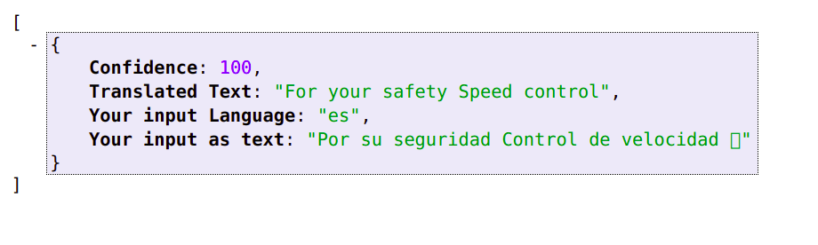

# Translator
A translator **api** using **flask** where we can perform:<br?>
-Speech Recognition (Speech-to-text) 
-OCR (Image to Text) 
-Text Translation 
-Speech Synthesis (Text-to-Speech) 

Sample:
###Input Image:

###Output result in JSON format:

